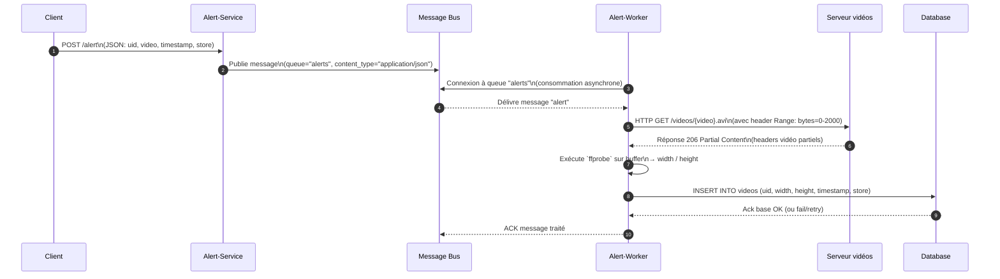

# Coding exercice
Il s'agit juste d'un exercice.

Ce projet est une plateforme de traitement d’alertes vidéos. Elle permet de :
- Recevoir des alertes via une API FastAPI (alert-service)
- Publier des messages dans RabbitMQ.
- Traiter les alertes via des workers qui traitent les vidéos


# Choix de l'architecture
Pour gérer les alertes, il y avait deux options : soit un seul pod qui traite plusieurs messages en parallèle avec asyncio, soit plusieurs pods qui se partagent la charge. Une approche hybride a été prise.

Chaque pod peut traiter plusieurs messages en même temps grâce à l’asynchrone, ce qui suffit dans la plupart des cas. Il est possible de scaler horizontalement grâce à l'architecture par évènement. 

# Diagramme de séquence


# Services principaux
- alert-service : API REST (FastAPI) pour publier des alertes dans RabbitMQ.
- alert-worker : Consommateur RabbitMQ, qui :
    - Télécharge les en-têtes vidéos via aiohttp.
    - Utilise ffprobe pour extraire width et height.
    - Sauvegarde les résultats dans la base PostgreSQL.
- RabbitMQ : File de messages.
- PostgreSQL : Stockage des alertes traitées.
- Nginx : Sert les fichiers vidéos.

# Installation locale
- git clone
- Lancer `setup_local.sh` pour le setup local

# Example de POST d'une alerte
```
curl -X POST "http://$(minikube ip):30000/alert" \
  -H "Content-Type: application/json" \
  -d '{
        "uid": "UID-1234",
        "video": "/videos/test.avi",
        "timestamp": 1720000000,
        "store": "store-42"
      }'
```

Ou pour un test de charge 

```
for i in {1..1000}; do
    curl -X POST "http://$(minikube ip):30000/alert" \
        -H "Content-Type: application/json" \
        -d '{
            "uid": "E00E9901-9246-4869-945A-7A0AABE1C382",
            "video": "/videos/test_1.avi",
            "timestamp": 1748871320.6882,
            "store": "test-store"
        }' &
done
```

# Validation manuelle
Pour valider le contenu en DB en local
```kubectl port-forward svc/postgres 5432:5432 -n alertsystem```
et lancer une shell 
```psql -h localhost -p 5432 -U veesion -d veesion```
pour valider le contenu dans la table videos.

# TODO
- Réponse au client, il faut passer par une notification en push via un Webhook
- Pas de tests, ni unitaire ni d’intégration
- Auto-scaling (HPA) basé sur la taille de la queue RabbitMQ.
- Monitoring (Prometheus + Grafana) pour suivre le nombre d’alertes traitées et les erreurs.
- Tests de charge pour déterminer le ratio optimal entre CONCURRENT_TASKS (async) et replicas (pods).
- Architecture hexagonale pour découpler la DB et RabbitMQ
